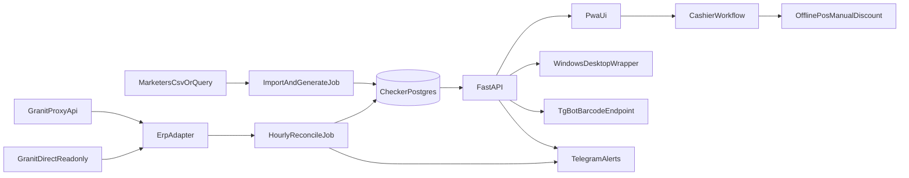

# Implementation Plan — Promocode Checker

Canonical project plan. Keep this updated when stage outcomes change decisions.

## Goal

Build a monorepo for validating unique customer promocodes, closing them at cashier points, reconciling usage against ERP sales, and surfacing admin/fraud visibility, with three environments: `local`, `railway-demo`, `server-prod`.

## Stack

- Backend: Python 3.11, FastAPI, SQLAlchemy, Alembic, PostgreSQL
- Frontend: React/Vite PWA (cashier + admin)
- Desktop: lightweight Windows/RDP wrapper over the same UI
- Deploy: Docker Compose locally/prod, Railway for demo, GitHub Actions CI/CD

## Architecture

## Repository layout

- `backend/` — FastAPI, models, migrations, services, ERP adapters, jobs
- `frontend/` — cashier PWA + admin UI
- `desktop/` — RDP-friendly desktop shell
- `infra/` — Docker, Compose, Railway, CI configs
- `docs/` — plan, decisions, prompts, reports, runbooks
- `scripts/` — helpers
- `tests/` — backend/frontend tests
- `config/` — business config such as coffee group IDs

## Branch flow

1. Work in `feature/*`
2. Stage tests + review + report
3. Merge into `develop`
4. Promote to `railway-demo` for demo
5. Promote validated code to `main` for server production

## Stage checklist

### Stage 1 — Bootstrap — DONE

- [x] Correct folder name `promocode-checker`
- [x] Git + `develop`
- [x] Python venv + pyproject
- [x] FastAPI health
- [x] Env template and base docs
- Report: `docs/reports/stage-01-bootstrap.md`

### Stage 2 — Data layer — DONE

- [x] Models: promocodes, checker_logs, fraud_warnings, admin_audit_logs, telegram_notification_logs
- [x] Alembic `001_initial_schema`
- [x] Promocode generator + TTL
- [x] Local Postgres compose on `5433`
- [x] Migration + 9 tests passed on live DB
- Report: `docs/reports/stage-02-data-layer.md`

### Stage 3 — Backend API — DONE

- [x] `POST /api/v1/cashier/check`
- [x] `POST /api/v1/cashier/redeem`
- [x] Code 128 barcode endpoint `GET /api/v1/cashier/barcode/{code}`
- [x] Seed/generate helper `scripts/seed_promocodes.py`
- [x] Shared cashier services for status transitions
- [x] API tests — 18 passed
- [x] Stage report: `docs/reports/stage-03-cashier-api.md`

### Stage 4 — ERP reconcile + Telegram — DONE

- [x] ERP adapter interface
- [x] Proxy mode + direct fallback + mock
- [x] Hourly reconcile job (`scripts/run_reconcile.py`)
- [x] Auto-close + erp_sale_matched
- [x] Fraud warning for unmatched manual closes
- [x] Soft window default 2h
- [x] Coffee group whitelist from segmentation project
- [x] Telegram alerts for changes/fraud/crashes
- [x] Tests + report (`docs/reports/stage-04-erp-reconcile.md`, 28 passed)

### Stage 5 — Cashier PWA — DONE

Gate: `docs/reports/supervisor-gate-stage5-2026-07-28.md`
Report: `docs/reports/stage-05-cashier-pwa.md`

- [x] One numeric input, length 8
- [x] Absolute autofocus recovery
- [x] Scanner Enter auto-submit
- [x] 1.5s debounce lock
- [x] Status colors + Redeem button
- [x] Audio feedback
- [x] point_id from query/settings
- [x] Session heartbeat without login
- [x] Tests/manual scanner checks + report (backend 29 / frontend 8)

Deferred (resolved by Stage 5/6 gate):

- concurrent redeem row-lock → **Stage 5.1 before Stage 6**
- live Granit SQL validation → Stage 4.1
- Telegram per-code auto-close → use run summary instead

### Stage 5.1 — Concurrent redeem lock — DONE

- [x] Row lock / safe close on redeem and shared close path
- [x] Tests for double-redeem race (sequential + concurrent)
- [x] Report `docs/reports/stage-05-1-redeem-lock.md`
- [ ] Supervisor PASS before Stage 6

### Stage 6 — Admin UI — DONE

- [x] Same Vite app, `/admin` login route
- [x] Roles admin/viewer from env
- [x] Dashboard + table browsers
- [x] Controlled edits + audit (USED→ACTIVE, fraud review)
- [x] Tests + report (`docs/reports/stage-06-admin-ui.md`)

### Stage 7 — Desktop wrapper — NEXT

- [ ] Lightweight shell for cashiers
- [ ] Point binding + fullscreen-friendly launch
- [ ] Tests/manual RDP check + report

### Stage 8 — Docker / Railway / server-prod

- [ ] App Dockerfile with static frontend
- [ ] Local and prod compose
- [ ] Railway demo config/env matrix
- [ ] Healthchecks + restart policies + crash alerts
- [ ] Tests/deploy smoke + report

### Stage 9 — CI/CD

- [ ] GitHub Actions lint/tests
- [ ] Branch → environment mapping
- [ ] Optional Railway/image deploy wiring
- [ ] Docs + report

### Stage 10 — Runbooks polish

- [ ] local / railway / server docs complete
- [ ] env matrix finalized
- [ ] employee launch instructions

## Business tables (checker Postgres)

### `promocodes`

- `id` UUID PK
- `customer_erp_id` VARCHAR indexed
- `promocode` VARCHAR(8) unique indexed, exactly 8 digits
- `status` ACTIVE|USED
- `created_at`
- `expires_at`
- `redeemed_at` nullable

### `checker_logs`

- `id` BIGSERIAL
- `promocode_id` UUID nullable FK
- `scanned_code`
- `scan_time`
- `action_type` SCAN_CHECK|MANUAL_CLOSE|AUTO_CLOSE
- `point_id`
- `erp_sale_matched` bool default false

### Extra tables already created for later stages

- `fraud_warnings`
- `admin_audit_logs`
- `telegram_notification_logs`

## Cashier flow

1. Customer receives TG barcode (Code 128 of 8-digit code)
2. Cashier scans into checker UI
3. Checker returns ACTIVE / USED / NOT_FOUND
4. If ACTIVE, cashier applies discount in offline POS manually
5. Cashier presses “Применить скидку” → USED
6. Hourly reconcile fixes forgotten ACTIVE codes using ERP sales
7. Unmatched manual closes create fraud warnings

## Neighbor project reuse

- Segmentation coffee groups: `granit-clients-based-segmentation/data/coffee_beans_kg_groups.json`
- Proxy/env patterns: `prices-monitoring-scrappers`, `granit-clients-based-segmentation`
- Docker prod: `dimkava-big-book`
- Railway alerts/cron: `stock-safety-monitor`

## Stage gate template

Every stage report in `docs/reports/` must include:

1. Planned scope
2. Implementation
3. Tests
4. Review notes
5. Risks and follow-ups / open questions
